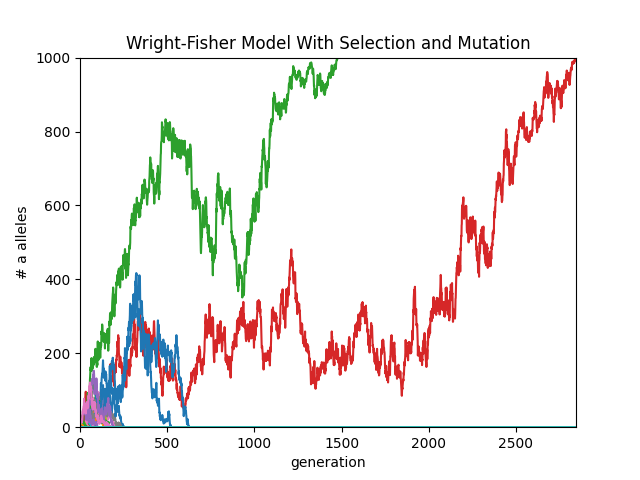

This is a basic Python implementation of the Wright-Fisher model. It supports selection and mutation. Fixation probabilities are calculated by simulating multiple individuals under the same settings.

For example, running with [beneficial parameters](wright_fisher.py?plain=1#L8), we get the following result:

.